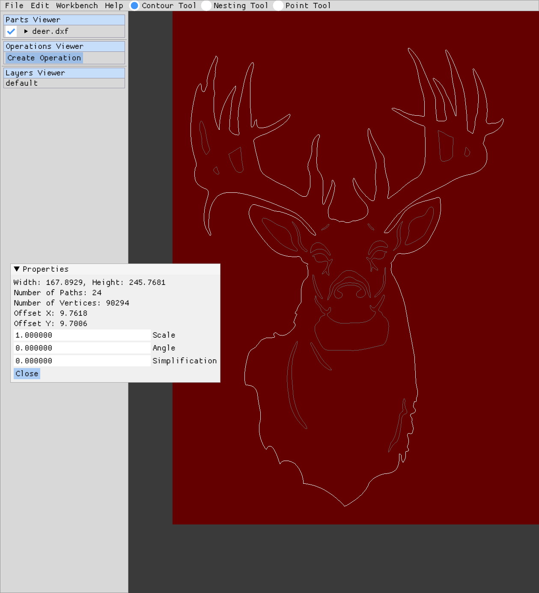

# NanoCut Control
Front-End Control Software for NanoCut CNC Controller (see [NanoCut CNC firmware](https://github.com/nwjnilsson/nanocut-firmware)).
NanoCut was forked from [ncPilot](https://github.com/UnfinishedBusiness/ncPilot/) to continue development for my own plasma machine.
NanoCut is Native Cross-Platform (Windows, Linux, and MacOS),
but I have currently only tested it on Linux.

# Features
- 2D Gcode Viewer
- Built-In Machine Parameter Editing (No editing of Config files necessary)
- Has a primary focus on CNC Plasma cutting and CNC Routing as a secondary focus
- Point-and-Click Jogging
- Arrow Key Jogging
- Click and Point Gcode Jump in (No need to manually find a gcode line to jump into). Just hold control and click on the contour you would like to start from
- User configurable Layout
- Built in torch touchoff routine. Instead of a gcode, use fire_torch [pierce_height] [pierce_delay] [cut_height]. torch_off to shut torch off
- Built-in Toolpath workbench. Setup job options material size. Lay parts out in any configuration and post Gcode ready to run on the machine. Also has an early Auto-Nesting feature.
## Changes made by me
- Add support limit pin inversion
- Add support non-standard homing position for X-axis
- Remove firmware update feature
- Add customizable precise jog distance
- Add support for click-and-drag movement of the control view (press and hold right click)
- Much more robust DXF importer.



## Important notes on using this software
- If you intend to use imperial units for your machine, go into `include/config.h`
and uncomment the `#define USE_INCH_DEFAULTS`.
- Negative machine extents is not supported.
Positioning in the negative quadrant is apparently common traditionally for CNC machines, and GRBL
reports positions like this by default.

# Post Processors
- SheetCAM post processor is included with the NanoCut firmware repository at [nanocut-firmware](https://github.com/Applooza/nanocut-firmware)
- NanoCut's built-in Toolpath Workbench posts gcode that specifically runs with NanoCut control/firmware setups.

# Simple plasma g-code program for slicing a sheet
Pierce at 3 mm, delay 1.6 seconds, lower to 1.5 mm cut height.
```
fire_torch 3.0 1.6 1.5
G1 X0 Y0 F2200
torch_off
M30
```

# Building
Building should be roughly the same for all platforms when using CMake. See
`shell.nix` for a list of what you will (roughly) need to build.
```
mkdir build && cd build
cmake .. -DCMAKE_INSTALL_PREFIX=<..> -DCMAKE_BUILD_TYPE=Release
make install
./NanoCut
```
