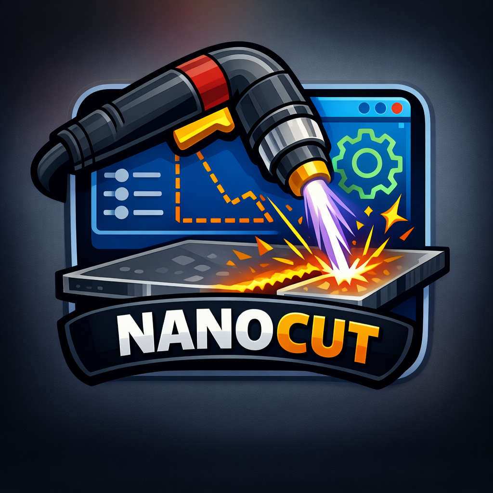
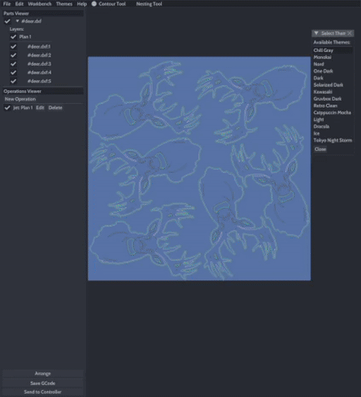

<div align="center" margin="20">
  
</div>

<br>

<div align="center">


</div>

<div align="center">

> _No Proma? No problem._

  [Documentation](https://nwjnilsson.github.io/nanocut-control)

</div>

# NanoCut Control

Cross-platform front-end control software for NanoCut firmware (see [NanoCut CNC firmware](https://github.com/nwjnilsson/nanocut-firmware)).
NanoCut was originally forked from [ncPilot](https://github.com/UnfinishedBusiness/ncPilot/) to continue development for my own plasma machine.
The codebase has changed quite a bit since then, with many new features having been added.

<div align="center">


</div>

## Features
- 2D GCode and machine viewer
- Built-in grbl and THC machine parameter editing
- Arrow key jogging (with ctrl + arrow for precise movement)
- Point-and-click jogging (click anywhere on machine plane)
- Point-and-click GCode jump-in: hold control and click on the contour you would like to start from
- Reversible contour direction: useful when a cut fails mid contour, restart in the other direction
- Built-in torch control routines/macros:
  * `fire_torch [pierce_height] [pierce_delay] [cut_height]`
  * `torch_off`
  * `touch_torch`
- Setting THC target voltage with e.g `$T=100.0`
- Built-in Toolpath workbench:
  * Setup job options such as material size
  * Supports multi-layer .dxf
  * Lay parts out in any configuration (scale/rotate)
  * Automatic nesting to minimize material usage
  * Post GCode ready to run on the machine
- Customizable color themes!

<div align="center">
  
</div>

## Important notes on using this software
- If you intend to use imperial units for your machine, go into `include/config.h`
and uncomment the `#define USE_INCH_DEFAULTS`.
- Negative machine extents is not supported.
Positioning in the negative quadrant is apparently common traditionally for CNC machines, and GRBL
reports positions like this by default.

## Developer notes
I've re-written large parts of the codebase to make it somewhat more readable.
The original codebase was kind of a nightmare. nlohmann::json was used for
pretty much _everything_ (return values, arguments, events) so it was hard
to follow what was going on. Most of that has been eliminated but there may
still be traces left of some pretty bizarre code.

The `--admin` and `--daemon` modes were never quite finished. I'm guessing the idea
was to manage multiple machines over a local network. If you'd have for example
one RPi controlling each machine, each of them could run the app as a daemon
and connect to a central instance that would distribute commands and upload
gcode etc. The plumbing is there but I don't have multiple machines myself so
I'm not motivated enough to finish it.

## Post Processors
A SheetCAM post processor is included with the NanoCut firmware repository at [nanocut-firmware](https://github.com/nwjnilsson/nanocut-firmware)
This was created by the author of ncPilot. I haven't tested this approach myself since NanoCut already
generates high quality GCode but for anyone who's interested you could potentially generate GCode with
SheetCAM and translate directly to NanoCut-compatible GCode. On the other hand, you'll miss out on certain
THC features this way.

# Simple plasma g-code program for slicing a sheet
Pierce at 3 mm, delay 1.6 seconds, lower to 1.5 mm cut height.
```
fire_torch 3.0 1.6 1.5
G1 X0 Y0 F2200
torch_off
M30
```

# Building
Building should be roughly the same for all platforms when using CMake. See
`shell.nix` for a list of what libraries you will (roughly) need. For more detailed
instructions, refer to the installation [instructions](https://nwjnilsson.github.io/nanocut-control)

```
mkdir build && cd build
cmake .. -DCMAKE_INSTALL_PREFIX=. -DCMAKE_BUILD_TYPE=Release
make install
./NanoCut
```
