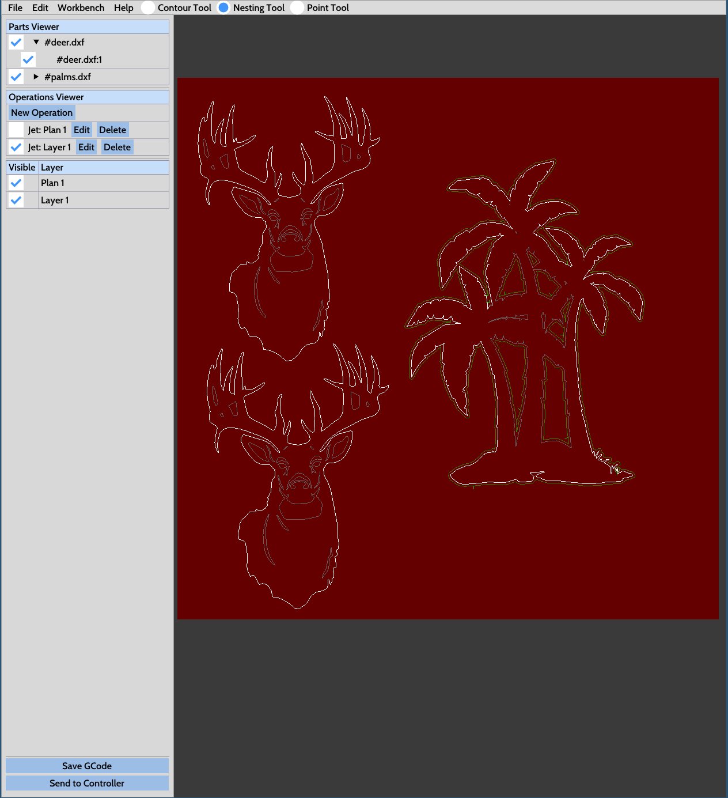

# NanoCut Control


> No Proma? No problem.

Front-End Control Software for NanoCut CNC Controller (see [NanoCut CNC firmware](https://github.com/nwjnilsson/nanocut-firmware)).
NanoCut was forked from [ncPilot](https://github.com/UnfinishedBusiness/ncPilot/) to continue development for my own plasma machine.
NanoCut is Native Cross-Platform (Windows, Linux, and MacOS),
but I have currently only tested it on Linux.

## Features
- 2D Gcode Viewer
- Built-In Machine Parameter Editing (No editing of Config files necessary)
- Has a primary focus on CNC Plasma cutting and CNC Routing as a secondary focus
- Arrow Key Jogging
- Click and Point Gcode Jump in (No need to manually find a gcode line to jump
into). Just hold control and click on the contour you would like to start from
- User configurable Layout
- Built in torch touchoff routine. Instead of a gcode, use fire_torch [pierce_height] [pierce_delay] [cut_height]. torch_off to shut torch off
- Built-in Toolpath workbench. Setup job options material size. Lay parts out in
any configuration and post GCode ready to run on the machine. Also has an early
Auto-Nesting feature.

The `--admin` and `--daemon` modes were never quite finished. I'm guessing the idea
was to manage multiple machines over a local network. If you'd have for example
one RPi controlling each machine, each of them could run the app as a daemon
and connect to a central instance that would distribute commands and upload
gcode etc. The plumbing is there but I don't have multiple machines myself so
I'm not motivated enough to finish it.

## Changes made by me
I've re-written large parts of the codebase to make it somewhat more readable.
The original codebase was kind of a nightmare. nlohmann::json was used for
pretty much _everything_ (return values, arguments, events) so it was hard
to follow what was going on. Most of that has been eliminated but there may
still be traces left of some pretty bizarre code. NanoCut also supports:
- limit pin inversion
- customizable precise jog distance
- machine jogging by clicking anywhere on machine plane
- panning control and CAM views (press and hold right click)
- much more robust DXF importer supporting variable quality and using proper NURBs
- multilayer .dxf support
- automatic part arrangement in CAM view to save material



## Important notes on using this software
- If you intend to use imperial units for your machine, go into `include/config.h`
and uncomment the `#define USE_INCH_DEFAULTS`.
- Negative machine extents is not supported.
Positioning in the negative quadrant is apparently common traditionally for CNC machines, and GRBL
reports positions like this by default.

# Post Processors
- SheetCAM post processor is included with the NanoCut firmware repository at [nanocut-firmware](https://github.com/nwjnilsson/nanocut-firmware)
- NanoCut's built-in Toolpath Workbench posts gcode that specifically runs with NanoCut control/firmware setups.

# Simple plasma g-code program for slicing a sheet
Pierce at 3 mm, delay 1.6 seconds, lower to 1.5 mm cut height.
```
fire_torch 3.0 1.6 1.5
G1 X0 Y0 F2200
torch_off
M30
```

# Building
Building should be roughly the same for all platforms when using CMake. See
`shell.nix` for a list of what you will (roughly) need to build.
```
mkdir build && cd build
cmake .. -DCMAKE_INSTALL_PREFIX=. -DCMAKE_BUILD_TYPE=Release
make install
./NanoCut
```
