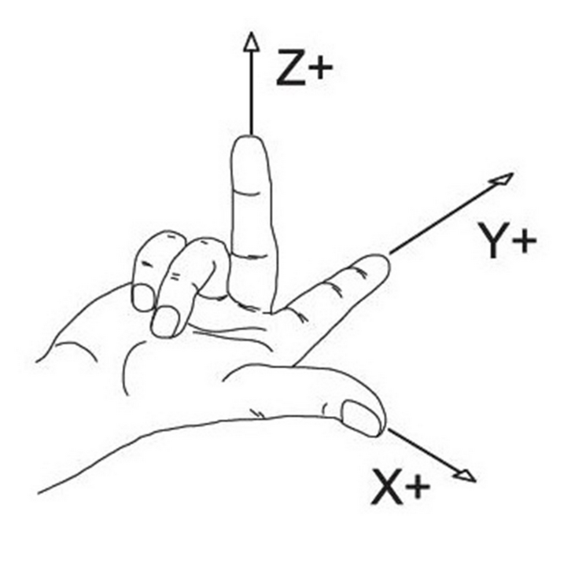

# Advice on building your own CNC plasma table

This page is for those who want to build their own table from scratch, like I did.
I mostly followed Bob's design from the [Making Stuff](https://www.youtube.com/c/makingstuff) YouTube channel.
He has a series where he covers most of the basic hardware needed to fabricate your own table.
I think he still has a BOM somewhere covering things like the square tubing,
linear rails, sensors etc. Where his design and mine differ though, is of course the
control software. Bob went with LinuxCNC and Mesa hardware. This is a perfectly
sane choice to make. The less sane choice is to fork the GRBL firmware and write
your own control software. Naturally, I picked the second option.

Going down this rabbit hole of writing much of the software myself has taught me a lot.
Money-wise I'd say I would have saved a lot by going with the Mesa hardware, considering
the time it took to get the software right. But where's the fun in that? Besides, this
project should enable others out there to build their CNC tables for _really_ cheap.
I'm running NanoCut on an old Raspberry Pi 4, and it is controlling the table through an
old Arduino Nano. Mesa does have cheaper alternatives today than they did back
when I started. Had this been available then, this is probably the route I would go.
On the other hand, you can run NanoCut on whatever laptop you have available,
so CNC control is basically just the price of an Arduino.

## Why use NanoCut at all?

There are many other solid choices out there, varying in prices and complexity.
Even though I started this project a long time ago, I still think NanoCut is a
good option today. It's free, extremely easy to use, and it is cross platform.
The most difficult part about it would be to configure GRBL and flashing the
firmware, but even that is already mostly taken care of if you reuse my own
configuration. Once you've wired up the plasma to the controller and configured
GRBL, going from a .dxf to cutting will be a piece of cake.

## Pitfalls to avoid when building your table

Building my table was mostly a straight-forward process. You take measurements,
cut tubes, weld, drill, tap, make cables, 3D-print a bit, and _Bob_'s your uncle.
The main roadblocks I hit were software related, and that is partly because I
didn't do my research ahead of time. This mainly came down to the _coordinate system_.

### The right-hand rule

I oriented my machine in a way that made sense for my workshop. My reasoning was:
"_I'll be running GRBL, it's so configurable that it won't be a problem_". Silly me.
I tried putting the origin in the bottom-right corner of the machine. Trying to make
that work was a dead end, so I flipped the gantry and repositioned my homing sensors.

If you google the "right hand rule", you'll see a number of different configurations.
Turns out, people from different backgrounds seem to have different interpretations
of it. So much for it being a _rule_, eh? The one that best fits my mental model of
how GRBL works is this one:

  

This image tells me that the origin of the machine should be in the bottom left
corner. If you think like a CNC machine, you might disagree with me, thinking:
"_THE ORIGIN SHOULD BE IN THE TOP RIGHT!!1_". Both would be correct. The thing
is: GRBL always represents Machine Coordinates (MCS) internally as negative
values. From this perspective, the origin is in the top right corner. My brain
seems to operate in workspace coordinates though, so the image above feels more natural
to me.

#### IMPORTANT

Because of how I ended up implementing machine jogging, where +X (right arrow
key) sends a negative machine coordinate (same for Y), my advice is to just put
your origin in the bottom left corner. For the Z axis, the origin is (internally)
at the lowest possible torch position. But you should of course wire it so that
it searches upwards for the switch. After homing, a WCS offset is applied to
the Z axis so that the top position has the maximum Z coortinate.

Technically, GRBL will even allow you to home toward any corner with per-axis
homing inversion and set that as your origin through `HOMING_FORCE_SET_ORIGIN`.
Avoid doing any of these things with NanoCut. I'm pretty sure things will get
weird quickly with motion commands and soft limits. _You should not need "Invert
homing direction X/Y/Z" or `HOMING_FORCE_SET_ORIGIN` if your machine is
"properly" set up_.

## Just do it

Building a CNC machine is fun. It's a somewhat strange feeling building a machine
and then seeing it produce parts that would take you days or weeks to do by hand.
You'll realize it can greatly help you in replicating itself. The first parts I
made on my machine were new gantry plates (the ones bolted to the linear bearings),
due to a poor initial design on the ones I drilled and tapped by hand. Having
built the machine from scratch makes seeing it re-produce the parts in seconds
all the more rewarding. So should you DIY it? Shia seems to think so

  

